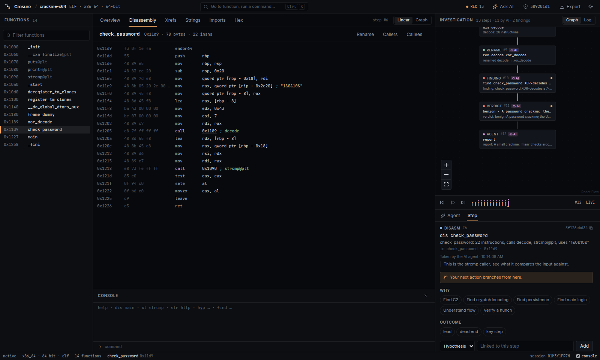
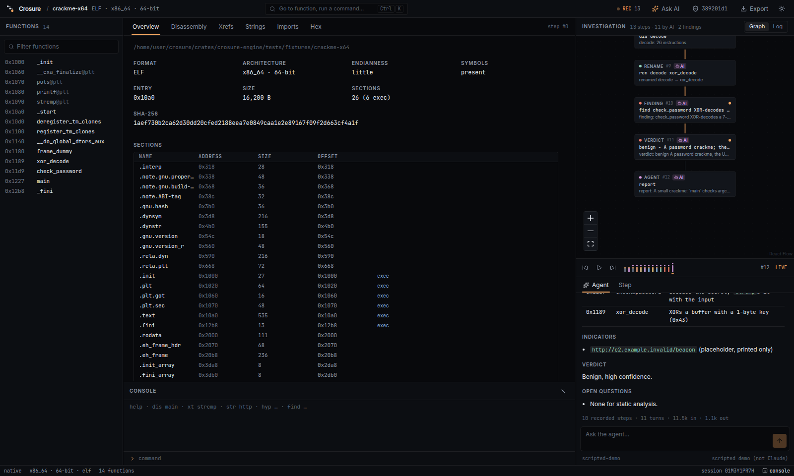
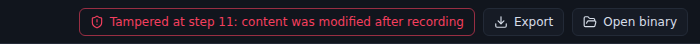
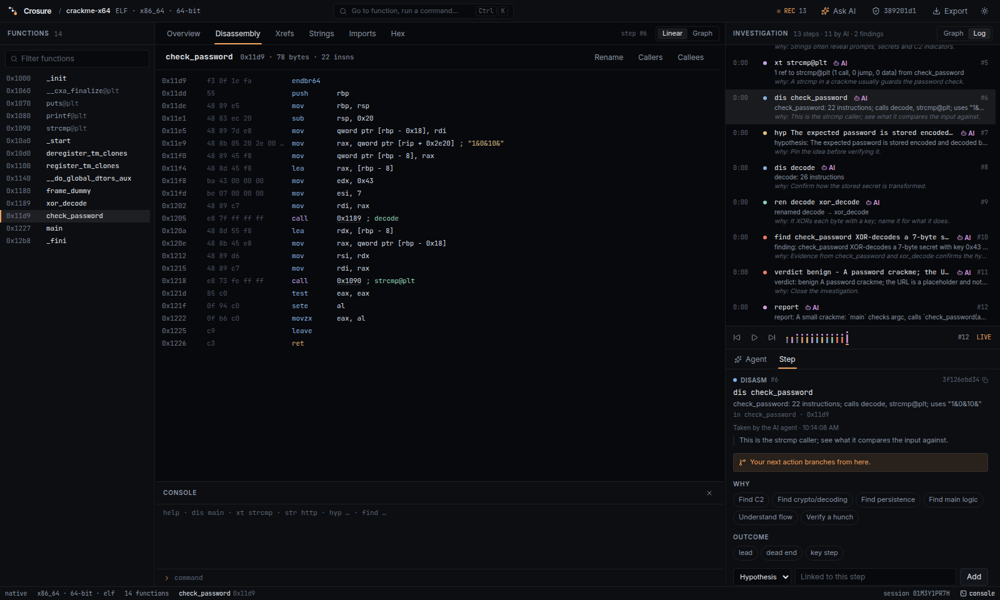

# Crosure

**Every reverse, remembered.** Crosure is a reverse-engineering workbench that
records every step an analyst takes as a live, replayable, **tamper-evident**
investigation graph, so investigations can be audited, taught, and turned
into training data for reverse-engineering and malware-analysis models.

Built for Innoventure 4.0 (Amity University). Full plan: [docs/PLAN.md](docs/PLAN.md).



## Ask the AI to reverse a file

Click **Ask AI** (Ctrl+L), or run it from the terminal:

```bash
export ANTHROPIC_API_KEY=sk-ant-...        # or save the key in the app
cargo run -p crosure-agent --bin crosure-reverse -- ./sample "Find how the input is validated"
```

**How it works:**
- Claude (`claude-opus-5-5` by default) reverses the binary using the same
  operations you have: functions, disassembly, xrefs, strings, imports, hex,
  rename, comment, hypothesis, finding, verdict.
- Every tool call goes through the recorder, so it lands on the investigation
  graph as an **AI** step, hash-chained. It carries the model's **reason**
  (`why`), which is required on every call.
- The agent finishes with a Markdown report: summary, key functions,
  indicators, verdict and open questions.
- You can click any AI step to inspect it, branch from it, or tag it.
- Human and AI steps share one graph, so the dataset gets expert *and* model
  trajectories with rationale.

**Providers and controls** ([docs/ai-agent.md](docs/ai-agent.md)):
- Supported providers:
  - Anthropic Claude;
  - any OpenAI-compatible server (OpenAI, Gemini, OpenRouter, Groq, DeepSeek, Mistral);
  - local Ollama or LM Studio.
- Steps record the provider and model that took them.
- If a provider declines, the same conversation can continue on the next
  provider in your list.
- Profiles (Investigate, Read-only, Ask) limit which tools the model gets.
- Per-tool permissions (allow, confirm, deny): on confirm the run pauses for
  your **Allow** or **Deny**, and denied calls are not recorded.
- Saved conversations per binary, with follow-ups.
- `@function` and `@#step` attach context to a prompt.
- Custom instructions are added to every thread.
- `crosure-mcp` serves the same recorded tools to any MCP client:
  `claude mcp add crosure -- crosure-mcp ./sample`.
- **Offline demo:** `CROSURE_AGENT_DEMO=1` (app) or `--demo` (CLI) runs a
  clearly labelled scripted model on the bundled crackme.



## What works today

- **Open ELF / PE / Mach-O binaries** with a pure-Rust engine (`object` + Capstone):
  functions (symbols, entry, call targets, code pointers, PLT/IAT import
  stubs, so it works on stripped binaries too), annotated disassembly,
  strings (ASCII + UTF-16LE), imports, cross-references, hex.
- **Decompiler (optional):** a **Decompiled** tab shows pseudo-C from
  rz-ghidra (via rizin), with your renames applied and calls you can follow.
  Setup: [docs/decompiler.md](docs/decompiler.md).
- **Training data:** **Export → Training dataset** (or `crosure-export`)
  writes verified investigations as trajectories, SFT examples and DPO
  preference pairs; `python/` verifies chains independently and loads the
  data for training. See [docs/datasets.md](docs/datasets.md).
- **Every action is a recorded step.** Clicking a function, following a call,
  searching strings, typing a console command (`dis main`, `xt strcmp`,
  `str http` …), renaming, adding a hypothesis or finding. Each one is a node with:
  - the exact command,
  - what it targeted,
  - a summary of what it showed,
  - the full result stored by content hash.
- **Native control-flow graph:** each function splits into basic blocks with
  taken / not-taken / jump edges. Switch Disassembly between **Linear** and
  **Graph**.
- **Investigation canvas** (React Flow). The graph grows live and edges are typed:
  - `next`: time order;
  - `derived_from`: you clicked something in a previous result;
  - `branch`: you jumped back to an older step and tried something else.

  The path to each finding is highlighted, and dead ends fade out.
- **Intent chips and tags.** One click records *why* a step was taken
  (*find C2*, *find crypto*, …) and how it turned out (lead, dead end, key
  step). Annotations are new steps and never edit old ones.
- **Hash chain.** Each step stores `sha256(prev_hash + canonical step)`. The
  verify badge re-derives the whole chain. Edit any stored step and it turns red:

  
- **Replay and flight log.** A scrubber shows the graph as it was after any
  step, and a **Log** view lists every step in time order with its command
  (`dis check_password`, `xt strcmp@plt`), outcome, intent and tags.
- **IDE shell:**
  - resizable panes;
  - tabbed results, where each tab links back to the step that produced it;
  - a status bar;
  - a **Ctrl+K** command palette (go to a function, run an action or a console command);
  - a console toggle (Ctrl+\`);
  - dark and light themes.

  
- **Export.** Writes the session (steps, graph, verification) to `~/.crosure/exports/*.json`.
- **Sessions persist** in SQLite (`~/.crosure/crosure.db`) and can be resumed.
  Renames are replayed from the log.

## Design

Crosure's look is a quiet IDE with one accent colour, *recorder amber*. It is
used only for recording, the key path and focus. The rules:

- **Colour carries meaning.** All colours are theme tokens in `tauri/src/theme.css`:
  - a desaturated disassembly palette;
  - one dot colour per step kind;
  - green and red for taken and not taken.
- **Type and size.**
  - A type scale of 10/11/12/13 px, with tabular numbers in every column.
  - Inter and JetBrains Mono are bundled, so the desktop app renders the same offline.
  - One `Pane` primitive gives every docked surface the same header, count and spacing.

## Layout

```
crates/
  crosure-recorder/   step schema, hash chain, SQLite + blob store, verify   (no other workspace deps)
  crosure-engine/     Engine trait + native backend (ELF/PE/Mach-O, x86/x64/ARM/AArch64)
  crosure-graph/      investigation graph: typed edges, annotations folded, key paths, replay, stats
  crosure-session/    runs ops on the engine and records each one; console parser
  crosure-agent/      AI agent: providers, tools, profiles, permissions, threads; crosure-reverse CLI
  crosure-mcp/        MCP server exposing the recorded tools to other agents
  crosure-dataset/    verified sessions -> trajectories / SFT / DPO JSONL; crosure-export CLI
python/               stdlib-only chain verifier and dataset loader (TRL / Hugging Face formats)
tauri/
  src/                React 19 + TypeScript frontend (Tailwind v4, React Flow, Zustand)
  src-tauri/          Tauri 2 app: thin commands over crosure-session; optional dev bridge
docs/                overview, plan, AI agent, datasets, decompiler
```

## Run it

Prerequisites: Rust ≥ 1.77, Node ≥ 20, and the
[Tauri Linux packages](https://v2.tauri.app/start/prerequisites/)
(`libwebkit2gtk-4.1-dev` etc.). Optionally install [`just`](https://github.com/casey/just).

```bash
just dev        # desktop app (cd tauri && npm install && npm run tauri dev)
just preview    # same UI in a browser: dev bridge on :1421 + Vite on :1420
just test       # cargo test --workspace + vitest
just lint       # clippy -D warnings + eslint
```

`CROSURE_HOME` overrides the data directory (default `~/.crosure`).

Try it on the bundled benign crackme:
`crates/crosure-engine/tests/fixtures/crackme-x64` (also `-stripped` and `.exe`).

## Console

```
info                         binary info
dis <fn|addr>                disassemble function
dec <fn|addr>                decompile function (needs rizin + rz-ghidra)
xt <fn|addr>                 xrefs to
xf <fn|addr>                 xrefs from function
str [filter]                 strings
imp                          imports
hex <addr> [len]             hex dump
ren <fn|addr> <name>         rename function
cmt <addr> <text>            comment
hyp <text>                   pin a hypothesis
find <text>                  record a finding
verdict <malicious|benign|unknown> <family|-> <text>
```

r2-style aliases also work (`pdf`, `pdg`, `axt`, `iz`, `ii`, `px`, `afn`).

## Safety

Analysis is static by default and nothing is executed. Never commit live malware
(see [samples/README.md](samples/README.md)).

## License

Apache-2.0
