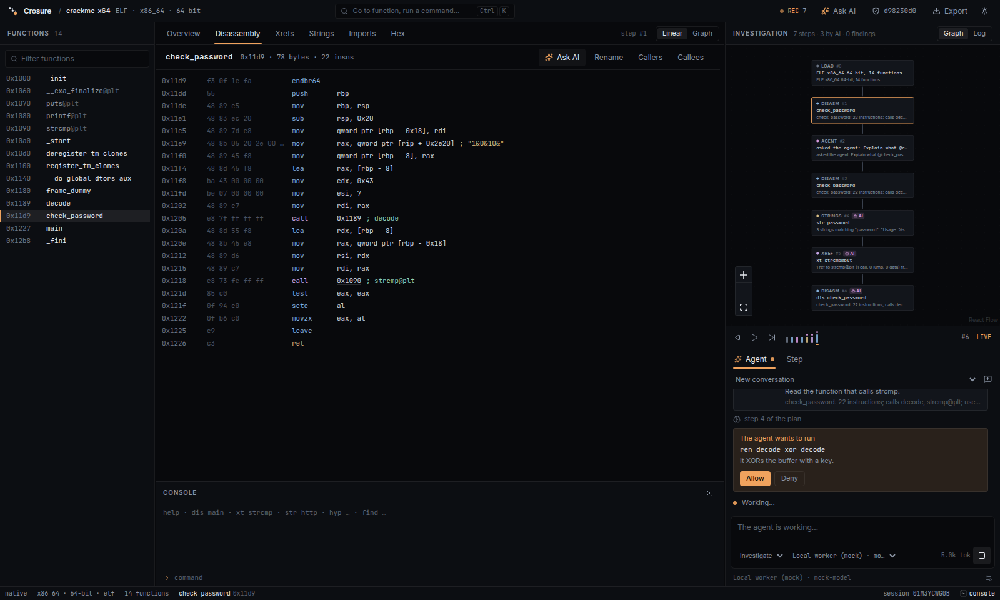

# The AI agent

Crosure's agent reverses a binary with the same operations an analyst has.
Every tool call goes through the recorder, so it lands on the investigation
graph as an **AI** step, hash-chained, with the model's stated reason.

The way the agent is put together borrows ideas (not code) from the
[Zed editor](https://github.com/zed-industries/zed)'s agent panel: provider
settings, profiles, tool permissions, threads, `@` mentions and MCP.



## Where things live

| Piece | Path |
| --- | --- |
| Agent loop, transcript, events | `crates/crosure-agent/src/agent.rs`, `transcript.rs`, `events.rs` |
| Tools (one per recorded op) | `crates/crosure-agent/src/tools.rs` |
| Profiles and permissions | `crates/crosure-agent/src/policy.rs` |
| Providers and settings | `crates/crosure-agent/src/providers/` |
| CLI | `crates/crosure-agent/src/bin/crosure-reverse.rs` |
| MCP server | `crates/crosure-mcp/` |
| App runtime (threads, approvals, mentions) | `tauri/src-tauri/src/agent/` |
| Agent panel UI | `tauri/src/components/agent/`, `tauri/src/store/agent.ts` |

## Providers

Settings live in `~/.crosure/agent.json` (mode 0600). You can edit them in
the app under **Agent settings → Providers**. Two wire protocols are
supported:

- **Anthropic Messages API.** The default model is `claude-opus-5-5`. Requests
  use adaptive thinking, prompt caching and strict tool schemas.
- **OpenAI-compatible chat completions.** This covers OpenAI, Google Gemini,
  OpenRouter, Groq, DeepSeek, Mistral, Ollama, LM Studio and any custom
  server.

Each provider has a label, base URL, model and key. A key can be saved, read
from an environment variable, or left out for local servers. Keys never reach
the UI. **Fetch models** lists what a server offers, which also tests the
connection.

Each step records the provider and model that produced it, for example
`ollama:qwen3`, so a dataset can tell models apart.

**Order and fallback.** The active provider runs first. If **auto-fallback**
is on and a provider declines a request, the same conversation continues on
the next ready provider in the list. The decline and the switch both show in
the transcript.

## Profiles

A profile limits which tools the model is offered. You pick it in the
composer. New threads start with the default profile from settings.

| Profile | Tools |
| --- | --- |
| Investigate | Every tool (including `decompile` when rz-ghidra is installed; see [decompiler.md](decompiler.md)). |
| Read-only | Every tool except rename and comment. Hypotheses, findings and the verdict are still allowed. |
| Ask | No tools; the model answers from the conversation and attached context. |

## Tool permissions

Each tool has one of three permissions: **allow**, **confirm** or **deny**.
On the Behaviour tab, one switch puts rename, comment and verdict on
**confirm**.

When a tool is on **confirm**, the run pauses and shows the exact command it
would record, with the model's reason, plus **Allow** and **Deny**. Denied or
blocked calls are reported back to the model and are **not recorded**.
Stopping a run while it waits counts as a deny.

## Instructions

Text on the Behaviour tab is appended to the system prompt of every thread.
Use it for house rules, for example: "Map behaviour to MITRE ATT&CK
techniques."

## Threads

A thread is a conversation about one binary. Follow-up questions keep the
whole conversation, including earlier tool calls and their results.

Threads are saved per session in `~/.crosure/threads/<session>.json` and can
be reopened from the thread picker above the transcript.

The graph records:
- each request as a human `ask …` step;
- each answer as an AI `report` step.

## `@` mentions

When you type `@` in the composer, an autocomplete appears:

- `@function_name` attaches the function's disassembly.
- `@#12` attaches step 12 (its command and summary).

Attaching is an action on the binary, so it is recorded too: as a human
disassembly step with the reason "attached to an AI prompt". The transcript
shows what you typed and marks that context was attached.

**Ask AI** on a function header fills in a prompt that mentions that
function.

## MCP: use Crosure from another agent

`crosure-mcp` serves Crosure's tools over the Model Context Protocol (stdio).
Any MCP client can then analyse a binary, and its calls are still recorded.

```bash
cargo build -p crosure-mcp
claude mcp add crosure -- ./target/debug/crosure-mcp ./sample
```

Steps from MCP clients are tagged `mcp:<client name>` and carry the `why`
argument. They appear on the same graph as everything else.

## CLI

```bash
cargo run -p crosure-agent --bin crosure-reverse -- ./sample "Find how the input is validated"
cargo run -p crosure-agent --bin crosure-reverse -- --demo ./sample "anything"
```

The CLI uses the providers from `~/.crosure/agent.json` (or
`ANTHROPIC_API_KEY`). `--demo`, and `CROSURE_AGENT_DEMO=1` in the app, run a
clearly labelled scripted model on the bundled crackme, so the loop can be
shown without a key.

## Events

The UI polls `agent_events(since)`. Each run emits these events:

- `started`, `thinking`, `message`;
- `tool_call` (command, reason, step id or error);
- `approval_requested` and `approval_resolved`;
- `refusal` and `switched`;
- `usage`;
- `finished` (report, turns, tokens), `failed` or `stopped`.

The same stream is saved with the thread, so a reopened conversation looks
the same as it did live.
