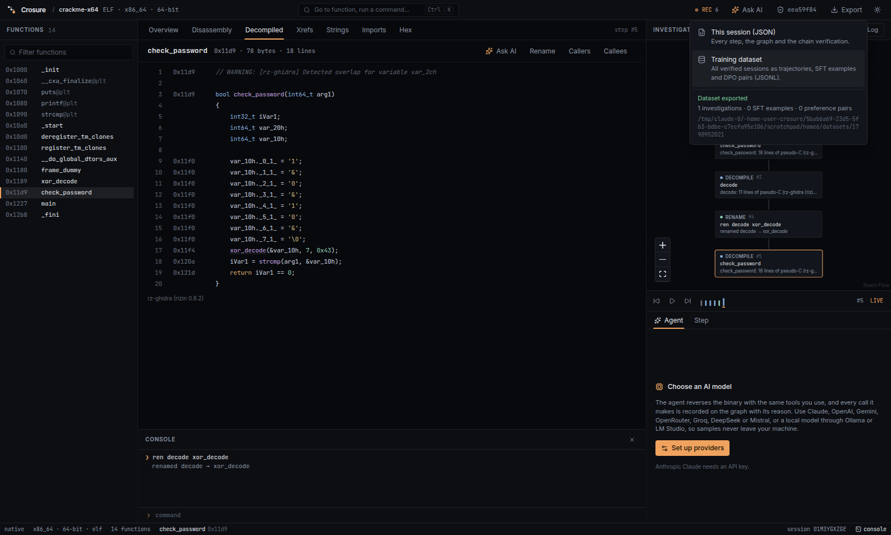

# Decompiler

The **Decompiled** tab, the `dec <fn>` console command (alias `pdg`), and
the agent's `decompile` tool all show a function as pseudo-C. The
decompiler is [rz-ghidra](https://github.com/rizinorg/rz-ghidra), running
inside [rizin](https://rizin.re).



Crosure works without them. Everything else uses the built-in Rust engine,
and the Decompiled tab tells you what to install.

## How it works

- Only the function you ask for is analysed (`af @ addr; pdgj @ addr`). This
  keeps large binaries fast. A run is stopped after 60 seconds.
- Rizin's names are mapped back to Crosure's:
  - `sym.imp.strcmp` becomes `strcmp`;
  - `fcn.000011d9` becomes your function name;
  - your **renames** apply too.

  String literals are left untouched.
- Each line shows the lowest address it was generated from.
- Calls to known functions are links. Clicking one decompiles that function,
  and like every action it is recorded.
- Picking a function in the list while the Decompiled tab is open
  decompiles it. Switching between Disassembly and Decompiled keeps the same
  function.

## Install

`$CROSURE_RIZIN` can point at the `rizin` executable. Otherwise `rizin` must
be on `PATH`. Restart Crosure after installing, because availability is
checked once per run.

**The rz-ghidra version must match rizin.** rz-ghidra's main branch follows
rizin's development API, so build the rz-ghidra tag that matches your rizin
release.

Ubuntu 24.04 does not package rizin, so build it from source:

```bash
sudo apt install build-essential cmake ninja-build pkg-config python3-pip \
  zlib1g-dev liblz4-dev libzstd-dev liblzma-dev libzip-dev libpcre2-dev \
  libxxhash-dev libssl-dev
pip install meson

git clone --depth 1 --branch v0.8.2 https://github.com/rizinorg/rizin
cd rizin
meson setup build --prefix=/usr/local --buildtype=release
ninja -C build && sudo ninja -C build install && sudo ldconfig
cd ..

git clone --depth 1 --branch v0.8.0 https://github.com/rizinorg/rz-ghidra
cd rz-ghidra && git submodule update --init --depth 1
cmake -B build -DCMAKE_INSTALL_PREFIX=/usr/local -DCMAKE_BUILD_TYPE=Release -DBUILD_CUTTER_PLUGIN=OFF
cmake --build build -j && sudo cmake --install build

rizin -qc 'Lc' -- | grep ghidra   # should list the plugin
```

On macOS, `brew install rizin`, then build the matching rz-ghidra tag the
same way.

## Tests

The decompiler tests run against the bundled crackme when rz-ghidra is
installed. Without it, they check the "not available" path instead, so CI
passes either way.
